# Variational Autoencoders
Tensorflow implementations for different variational autoencoders applied to MNIST dataset. This respository is created for practice and testing purposes for different methods. Please let me know if there is any bug or mistake in this respository. Thank you.
 
## Install Dependencies
```
pip install -r requirements.txt
```
## Multi-facet Clustering Variational Autoencoder
[Implementation](./models/mfcvae.py) of multi-facet clustering variataional autoencoder from [Multi-Facet Clustering Variational Autoencoders (Falck et al., NeurIPS 2021)](https://arxiv.org/abs/2106.05241). Similar to VLAE, the progressive training is also [implemented](./models/mfcvae.py)
  ### Generated Images (`n_facets=3, n_components=10`)
  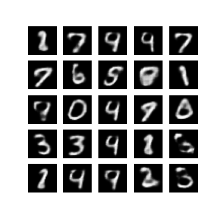
  ### Latent Representations First Facet (Digit) (`n_facets=3, n_components=10`)
  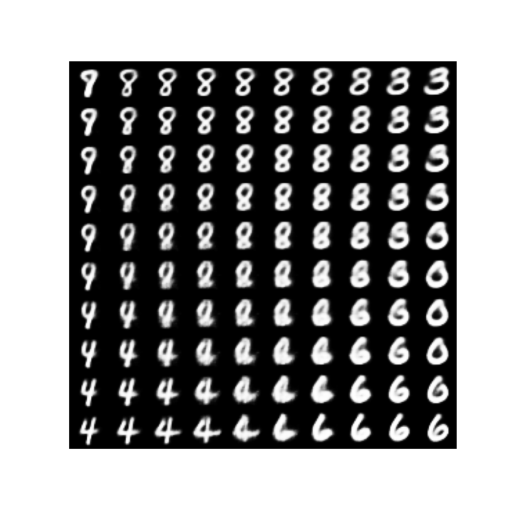
  ### Latent Representations Second Facet 2 (Thickness) (`n_facets=3, n_components=10`)
  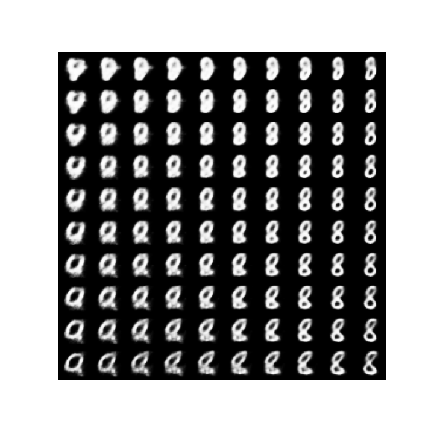
  ### Latent Representations Third Facet (Tilt) (`n_facets=3, n_components=10`)
  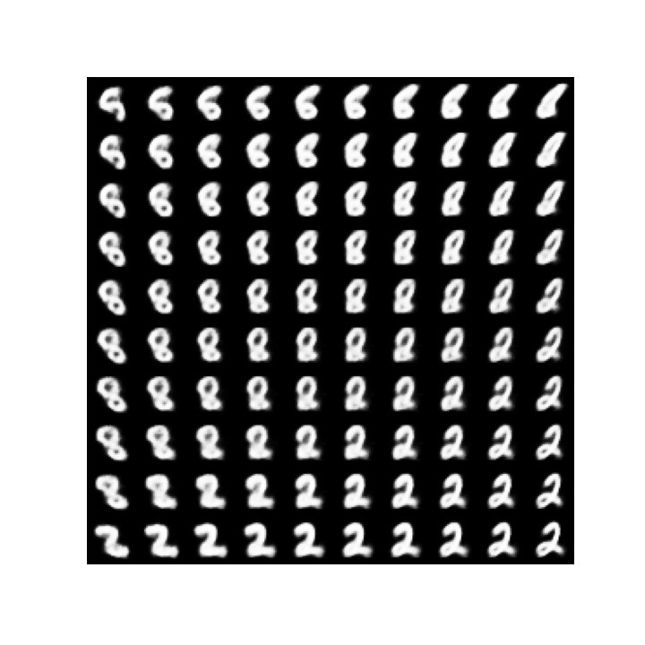

## Variational Ladder Autoencoder
[Implementation](./models/vlae.py) of variational ladder autoencoder from [Learning Hierarchical Features from Generative Models (Zhao el al., PMLR 2017)](https://arxiv.org/abs/1702.08396?context=stat). Followed by the paper, progressive training is also [implemented](./models/provlae.py).
  ### Generated Images (`with progressive training`)
  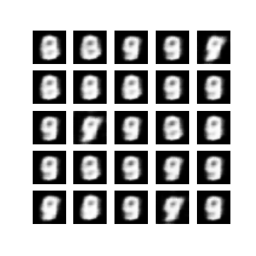
  ### Latent Representations (`with progressive training`)
  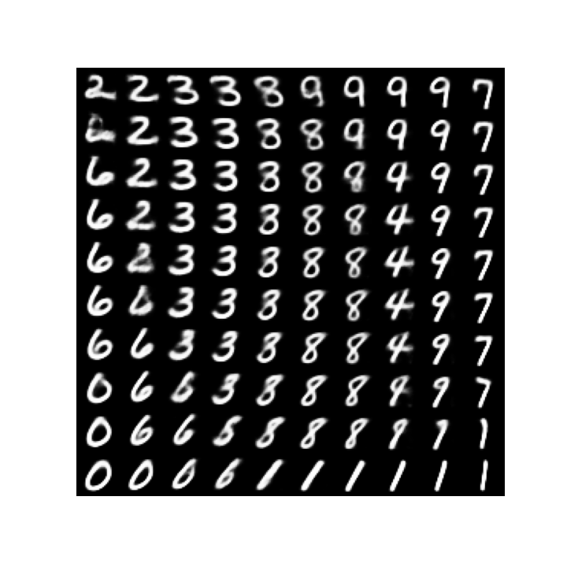

## Variational Deep Embeeding (VaDE)
[Implementation](./models/vade.py) of variational deep embedding from [Variational Deep Embedding: An Unsupervised and Generative Approach to Clustering (Jiang et al., IJCAI 2017)](https://arxiv.org/abs/1611.05148)
  ### Generated Images (`n_components=10`)
  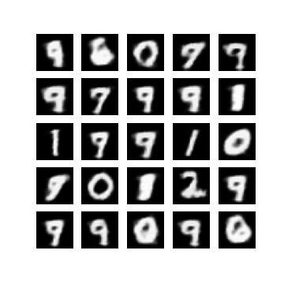
  ### Latent Representations (`n_components=10`)
  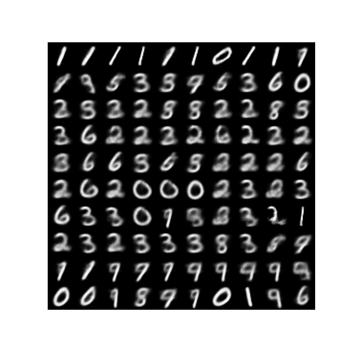

## Conditional Variational Autoencoder
[Implementation](./models/cvae.py) of conditional variational autoencoder from [Learning Structured Output Representation using Deep Conditional Generative Models (Sohn et al., NeurIPS 2015)](https://papers.nips.cc/paper/2015/hash/8d55a249e6baa5c06772297520da2051-Abstract.html).
  ### Generated Images
  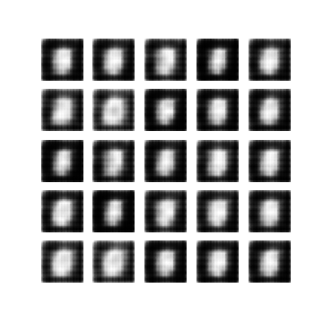
  ### Latent Representations (`each row is conditioned on digits`)
  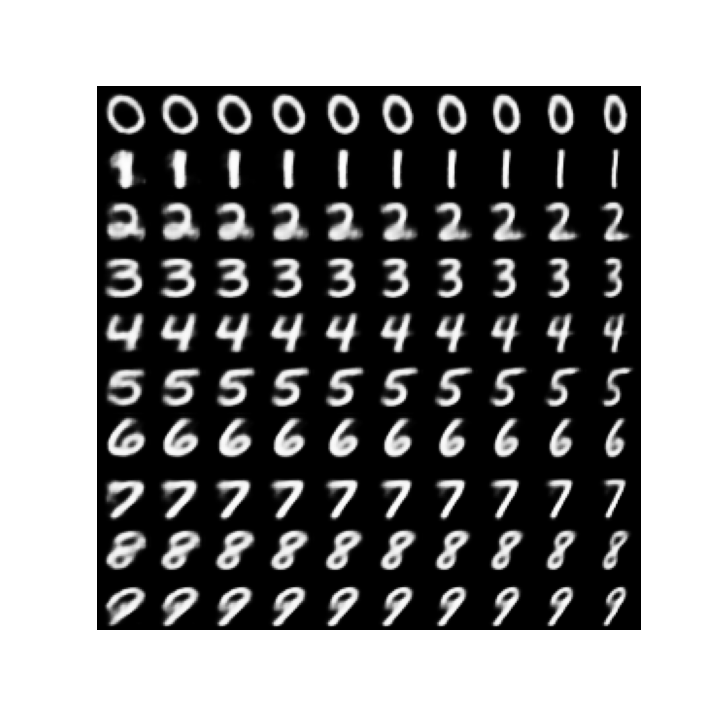


## Factor Variational Autoencoder
[Implementation](./models/factorvae.py) of factor variational autoencoder from [Disentangling by Factorising (Kim and Mnih, NeurIPS 2017)](https://arxiv.org/abs/1802.05983).
  ### Generated Images
  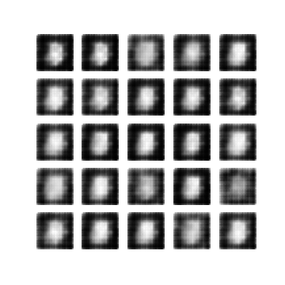
  ### Latent Representations
  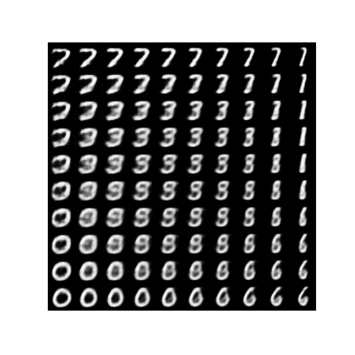

## Total Correlation Variational Autoencoder
[Implementation](./models/tcvae.py) of total correlation variataional autoencoder from 
[Isolating Sources of Disentanglement in VAEs (Chen et al., NeurIPS 2018)](https://arxiv.org/abs/1802.04942).
  ### Generated Images
  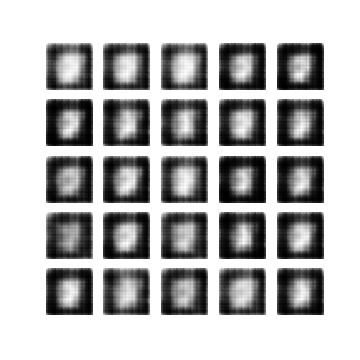
  ### Latent Representations
  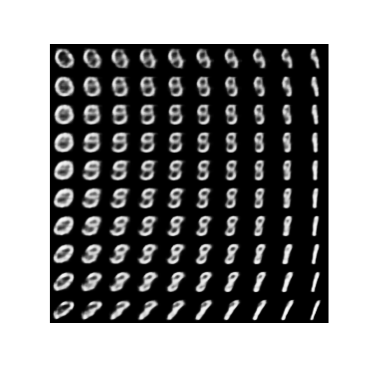

## (Beta) Variational Autoencoder
[Implementation](./models/betavae.py) of variational autoencoder from [Auto-Encoding Variational Bayes (Kingma et al., ICLR 2014)](https://arxiv.org/abs/1312.6114) and beta variational autoencoder from [beta-VAE: Learning Basic Visual Concepts with a Constrained Variational Framework (Higgins et al., ICLR 2017)](https://openreview.net/forum?id=Sy2fzU9gl).
  ### Generated Images
  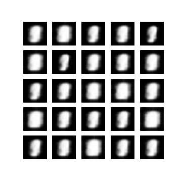
  ### Latent Representations
  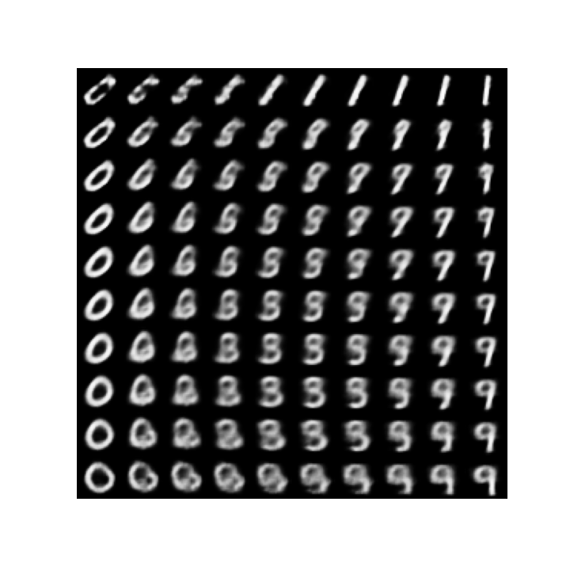

## Other implementations
1. Ladder variational autoencoder ([Ladder Variational Autoencoders by Sønderby et al., NeurIPS 2016](https://arxiv.org/abs/1602.02282))
2. Relevance factor variational autoencoder ([Relevance Factor VAE: Learning and Identifying Disentangled Factors by Kim et al., 2019](https://arxiv.org/abs/1902.01568))
3. Multi-level variational autoencoder ([Multi-Level Variational Autoencoder Learning Disentangled Representations by Bouchacourt et al., AAAI 2018](https://arxiv.org/abs/1705.08841))
3. (Soft) Introspective variational autoencoder ([Soft-IntroVAE: Analyzing and Improving the Introspective Variational Autoencoder by Daniel and Tamar., CVPR 2021](https://arxiv.org/abs/2012.13253))